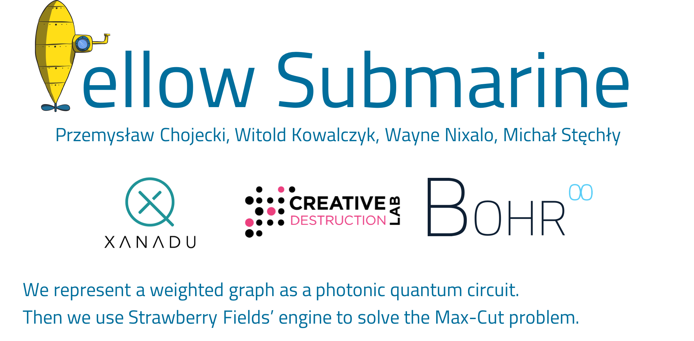

# Yellow submarine - solving Max-Cut problem using Strawberry Fields

This repository contains code for solving the Max-Cut problem using the continuous variables quantum computing paradigm.
Given a matrix that represents a graph, we embed that matrix into the a quantum circuit which we then use to find
the maximum cut of the initial graph.

Of particular interest is the behavior of the solution in the presence vs the absence of non-Gaussian gates.
Of additional interest is the comparison of graph embedding schemes, specifically the use of Gaussian covariance
matrices versus the Takagi decomposition.


## Summary

The Max-Cut problem is a problem that's know to be NP-complete. This means that while we may not have
an algorithm for solving it that runs in polynomial time, we can take advantage of new computing power
to solve the problem for graphs of bigger sizes.

In this repository, we encode the graph as a quantum circuit using the Takagi decomposition.
We then use a variational circuit to help solve the problem. The variational circuit parameters are optimized
during training to provide the optimal solution.


## Results

We carried researched on using this repository and the details of the investigation can be found at 
[Yellow Submarine Research](https://github.com/BOHRTECHNOLOGY/public_research/tree/master/Experiments/Yellow_submarine).

The outcome of the research has been published and can be found [Approaching graph problems with continuous variable quantum computing](https://arxiv.org/abs/1906.07047).
The repository linked above can be used to reproduce the research.


## Running the simulation

Using a virtual environment or conda is recommended.

Please install the requirements by running:

```
pip install -r requirements.txt.
```

After all requirements have been installed, please run:

```
$ python yellow_submarine/example.py
```

If you are on \*nix systems, you can give executable permission to `yellow_submarine/example.py` and run:

```
$ ./yellow_submarine/example.py
```


## License

This work is licensed under the MIT license.


## Contact

Please email Michał Stęchły at <a href="mailto:michal.stechly@gmail.com">michal.stechly@gmail.com</a>
if you need clarifications, improvements or help with this repository.
